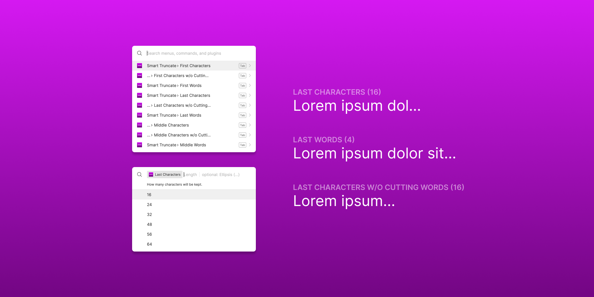

# Figma Smart Truncate

Changes the case of text in selected nodes to `Sentence case`, `Title Case`, `UPPER CASE` or `lower case`. 

Supports locale conversion, which means, it converts `istanbul` to `İSTANBUL`, if `Turkish` language chosen.

### How to Use

- Select nodes containg texts to truncate.
- Choose a conversion command under `Plugins -> Smart Truncate` menu or start typing the command name in Figma's quick actions search bar (`⌘` + `/` on Mac or `Ctrl` + `/` on Windows).
- Enter the length of characters or words by typing or selecting one of the suggestions.
- Hit `Enter` again to use default ellipsis (…) or type whatever you want
